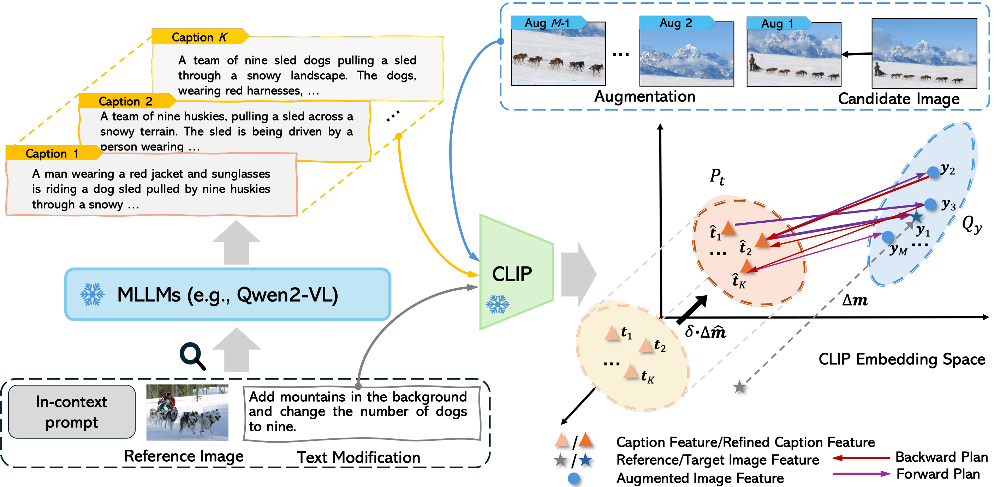

# STiTch: Semantic Transition and Transportation in Collaboration for Training-Free Zero-Shot Composed Image Retrieval 

Training-free zero-shot composed image retrieval models are recently gaining increasing research interest due to their generalizability and flexibility in unseen multimodal retrieval. Recent LLM-based advances focus on generating the expected target caption by exploring the compositional ability behind the LLMs. Although efficient, we find that 1) the generated captions tend to introduce unexpected features from the reference image due to the semantic gap between the input image and text modification, where the image contains much more details than the text; 2) the point-to-point alignment during the retrieval stage fails to capture diverse compositions. To address these challenges, we introduce a novel Semantic Transition and Transportation in collaboration framework for training-free zero-shot CIR tasks. Specifically, given the composed caption inferred by an LLM, we aim to refine it through a transition vector in the embedding space and make it closer to the target image. Combining LLMs with user instruction, the refined caption concentrates more on the core modification intent and thus filters out unnecessary noise. Moreover, to explore diverse alignment during the retrieval stage, we model the caption and image as discrete distributions and reformulate the retrieval task as a set-to-set alignment task. Finally, a bidirectional transportation distance is developed to consider fine-grained alignments across modalities and calculate the retrieval score. Extensive experiments demonstrate that our method can be general, effective, and beneficial for many CIR tasks.
